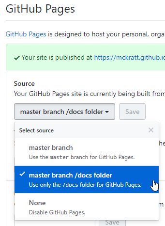

# Présentation starter

Ce projet permet de créer facilement des présentations correspondantes au style de la Mobilière basée sur Asciidoc et Reveal.js.

## Création de la présentation

Il suffit de *forker* ce reporitory pour commencer une nouvelle présentation

### Forker le starter

* Créez un nouveau repo sur Githu et clonez le :
```
git clone https://github.com/UserName/nouveau-repo.git
```

* Ajouter le repo presentation-starter au nouveau-repo et "pomper" le source du starter
```
cd nouveau-repo
git remote add upstream https://github.com/McKratt/presentation-starter.git
git pull upstream master
```

* Votre repo est prêt et vous pouvez pousser le repo sur Github :
```
git push origin master
```

* Ajoutez votre présentation dans [index.ad](src/main/asciidoc/index.ad)

## Publication de la présentation

Avec la fonctionnalité des Github Pages, la présentation sera automatiquement publiée sur internet.

Simplement activer la fonctionnalité dans les settings du projet github :



Une fois que vous avez activer la fonctionnalité, le lien correspondant apparait juste au dessus et vous pouvez cliquer dessus pour voir votre présentation.
